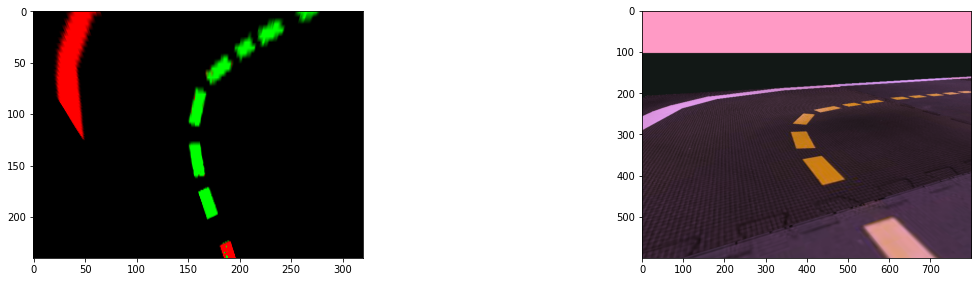
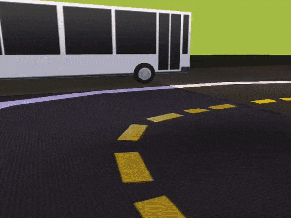

# 🚗 PoliDuckie Reinforcement Learning 🚙
Folder with our experiments on autonomous driving with Reinforcement Learning and the [Duckietown](https://www.duckietown.org/) platform.

## Preprocessing
We tried line extraction and bird eye view. During training we saw improvements using line extraction while birdeye didn't improve our model.

## Results

## Team
- [Ksenia Chigibaeva](https://www.github.com/chigibaeva)
- [Giorgio Miani](https://www.github.com/Giorgio-Miani)
- [Toma Sikora](https://www.github.com/sikora-toma)
- [Giulio Vaccari](https://www.github.com/giuliovv)
- [Davide Viviani](https://www.github.com/DavViviani)
- [Gabriel Voss](https://www.github.com/DavViviani)

